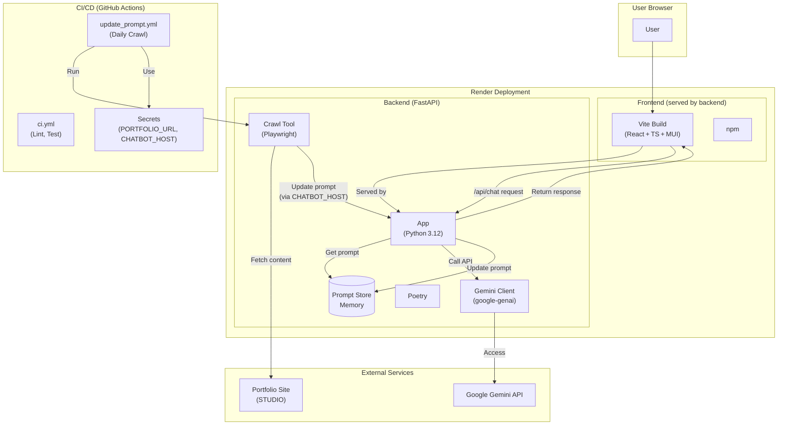
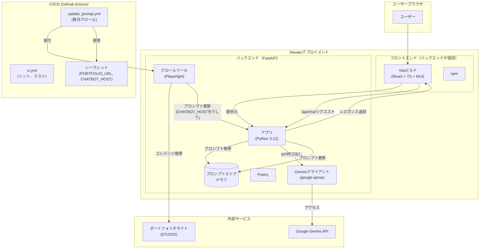

<a href="README.md#english" data-pjax="0">English</a> |
<a href="README.md#japanese" data-pjax="0">日本語</a>

<h2 id="english"></h2>

# Portfolio-ChatBot

**Solo side‑project** — A chatbot that lives inside my online portfolio  
(<https://hayatasakataportfolio.studio.site/>) and keeps itself **always up‑to‑date** by crawling the page daily.

[](#license)  

<p align="center">
  <a href="https://hayatasakataportfolio.studio.site/" target="_blank"><strong>▶︎ Try it now!</strong></a>
</p>


## ✨ Why / Impact
Recruiters often skim dozens of portfolios. This bot answers their questions in natural language, cutting their reading time while showcasing my projects interactively.

## 🔑 Key Features
| Category            | Description                                                                     |
|---------------------|---------------------------------------------------------------------------------|
| **Iframe Ready**    | Drop‑in embed for any STUDIO site.                                              |
| **Auto‑Crawl**      | Playwright fetch → diff → prompt regenerate (daily via GitHub Actions).          |
| **Instant Deploy**  | Single Render service hosts **FastAPI backend + built React frontend**.         |
| **Zero‑Ops**        | No database; prompt lives in memory and reloads in‑place.                       |

## 🛠 Tech Stack
- **Frontend** Vite · React · TypeScript · MUI
- **Backend** Python 3.12 · FastAPI · Pydantic · Playwright · google‑genai
- **Tooling** Poetry · npm · Ruff · Mypy
- **CI/CD** GitHub Actions
- **Hosting** Render

## 📂 Repository Layout
```text
portfolio_chatbot/
├── .github/
│   └── workflows/               # GitHub Actions workflows
│       ├── ci.yml               # Backend lint/test CI
│       └── update_prompt.yml    # Prompt auto-update (daily crawl)
├── backend/
│   ├── app/                     # Core FastAPI application
│   │   ├── api/                 # API endpoint definitions
│   │   │   ├── chat.py          # Chat API (/api/chat)
│   │   │   └── prompt.py        # Prompt update/retrieve API (/api/prompt/*)
│   │   ├── models.py            # Pydantic data models
│   │   ├── prompt_store.py      # Prompt storage (in-memory)
│   │   ├── session_manager.py   # Chat session management (in-memory)
│   │   └── main.py              # FastAPI entry point and static file serving
│   ├── tools/                   # Utility tools
│   │   └── crawl_and_patch.py   # Portfolio site crawling & prompt-update script
│   ├── prompt_config.py         # Prompt template configuration
│   ├── pyproject.toml           # Poetry dependency definitions
│   └── poetry.lock              # Dependency lock file
├── frontend/
│   ├── src/                     # React application source
│   │   ├── components/          # React components
│   │   │   └── ChatWidget.tsx   # Chat UI component
│   │   ├── App.tsx              # Main application component
│   │   ├── theme.ts             # MUI theme customization (chat colors, etc.)
│   │   └── main.tsx             # React app entry point
│   ├── index.html               # HTML entry point
│   ├── package.json             # npm dependency definitions
│   └── vite.config.ts           # Vite configuration file
├── .gitignore                   # Git ignore file
└── README.md                    # This file
```

## 🏗 Architecture



## 🚀 Local Setup

1.  **Clone the repository:**
    ```   
    git clone <repository-url>
    cd portfolio_chatbot
    ```
2.  **Build Frontend:**
    *   Navigate to the frontend directory: cd frontend
    *   Install dependencies: npm install
    *   Build static files: npm run build (Output will be in frontend/dist)
    *   Navigate back to root: cd ..
3.  **Backend Setup & Run:**
    *   Navigate to the backend directory: cd backend
    *   Create a .env file and set GOOGLE_API_KEY and optionally PORTFOLIO_URL, CHATBOT_HOST (for local testing of the crawl script).
    *   Install dependencies: poetry install
    *   Run the backend server: poetry run uvicorn app.main:app --reload --port 8000
    *   Access the application at http://localhost:8000 (Backend serves frontend)

## 🤖 System Prompt Lifecycle

1. **Daily Action** runs `crawl_and_patch.py`.
2. New HTML → new prompt → `/api/prompt/update` → in‑memory store hot‑swaps.
3. Manual re‑run possible from the Actions tab.


<h2 id="japanese"></h2>
<br><br>

# Portfolio-chatbot

**個人プロジェクト** — オンラインポートフォリオ  
（<https://hayatasakataportfolio.studio.site/>）内に組み込まれたチャットボットで、毎日サイトをクロールして**常に最新の情報**を提供します。

[](#license)  

<p align="center">
  <a href="https://hayatasakataportfolio.studio.site/" target="_blank"><strong>▶︎ 今すぐ試す!</strong></a>
</p>


## ✨ なぜ作ったか／影響
採用担当者は多くのポートフォリオを短時間で確認します。このボットは自然言語で質問に答え、閲覧時間を短縮しながら、プロジェクトをインタラクティブに紹介します。

## 🔑 主な機能
| カテゴリ           | 説明                                                                     |
|---------------------|---------------------------------------------------------------------------------|
| **Iframe対応**    | 任意のSTUDIOサイトに簡単に埋め込み可能。                                              |
| **自動クロール**     | Playwright取得 → 差分検出 → プロンプト再生成（GitHub Actionsで毎日実行）。          |
| **即時デプロイ**  | 単一のRenderサービスで**FastAPIバックエンド + ビルド済みReactフロントエンド**をホスト。         |
| **ゼロオペレーション**        | データベース不要；プロンプトはメモリ内に保持され、その場で再読み込み。                       |

## 🛠 技術スタック
- **フロントエンド** Vite · React · TypeScript · MUI
- **バックエンド** Python 3.12 · FastAPI · Pydantic · Playwright · google‑genai
- **ツール** Poetry · npm · Ruff · Mypy
- **CI/CD** GitHub Actions
- **ホスティング** Render

## 📂 リポジトリ構成
```text
portfolio_chatbot/
├── .github/
│   └── workflows/               # GitHub Actionsワークフロー
│       ├── ci.yml               # バックエンドのリント/テストCI
│       └── update_prompt.yml    # プロンプト自動更新（毎日クロール）
├── backend/
│   ├── app/                     # CoreのFastAPIアプリケーション
│   │   ├── api/                 # APIエンドポイント定義
│   │   │   ├── chat.py          # チャットAPI (/api/chat)
│   │   │   └── prompt.py        # プロンプト更新/取得API (/api/prompt/*)
│   │   ├── models.py            # Pydanticデータモデル
│   │   ├── prompt_store.py      # プロンプトストレージ（メモリ内）
│   │   ├── session_manager.py   # チャットセッション管理（メモリ内）
│   │   └── main.py              # FastAPIエントリーポイントと静的ファイル提供
│   ├── tools/                   # ユーティリティツール
│   │   └── crawl_and_patch.py   # ポートフォリオサイトクロール＆プロンプト更新スクリプト
│   ├── prompt_config.py         # プロンプトテンプレート設定
│   ├── pyproject.toml           # Poetry依存関係定義
│   └── poetry.lock              # 依存関係ロックファイル
├── frontend/
│   ├── src/                     # Reactアプリケーションソース
│   │   ├── components/          # Reactコンポーネント
│   │   │   └── ChatWidget.tsx   # チャットUIコンポーネント
│   │   ├── App.tsx              # メインアプリケーションコンポーネント
│   │   ├── theme.ts             # MUIテーマカスタマイズ（チャットの色など）
│   │   └── main.tsx             # Reactアプリのエントリーポイント
│   ├── index.html               # HTMLエントリーポイント
│   ├── package.json             # npm依存関係定義
│   └── vite.config.ts           # Vite設定ファイル
├── .gitignore                   # Gitの無視ファイル
└── README.md                    # このファイル
```

## 🏗 アーキテクチャ



## 🚀 ローカルセットアップ

1.  **リポジトリのクローン:**
    ```   
    git clone <リポジトリURL>
    cd portfolio_chatbot
    ```
2.  **フロントエンドのビルド:**
    *   フロントエンドディレクトリに移動: cd frontend
    *   依存関係のインストール: npm install
    *   静的ファイルのビルド: npm run build (出力はfrontend/distに生成されます)
    *   ルートに戻る: cd ..
3.  **バックエンドセットアップと実行:**
    *   バックエンドディレクトリに移動: cd backend
    *   .envファイルを作成し、GOOGLE_API_KEYと必要に応じてPORTFOLIO_URL、CHATBOT_HOST（クロールスクリプトのローカルテスト用）を設定。
    *   依存関係のインストール: poetry install
    *   バックエンドサーバーの実行: poetry run uvicorn app.main:app --reload --port 8000
    *   http://localhost:8000 でアプリケーションにアクセス（バックエンドがフロントエンドを提供）

## 🤖 システムプロンプトのライフサイクル

1. **日次アクション**が`crawl_and_patch.py`を実行。
2. 新しいHTML → 新しいプロンプト → `/api/prompt/update` → メモリ内ストアがホットスワップ。
3. Actionsタブから手動での再実行も可能。