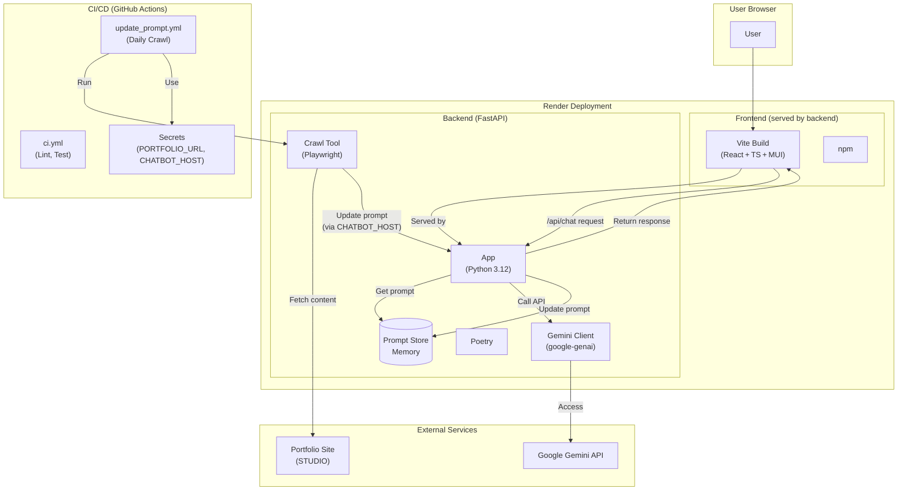

# Portfolio-ChatBot

This project implements a chatbot for a portfolio website hosted on STUDIO.
The chatbot is embedded as an iframe and keeps its knowledge up-to-date by periodically crawling the portfolio site.
- <https://hayatasakataportfolio.studio.site/>

## Features

*   **iframe Embedding:** Easily embed the chatbot into a STUDIO site.
*   **Automatic Updates:** Regularly crawls the portfolio site, detects changes, generates a new system prompt, and updates the chatbot automatically via GitHub Actions.
*   **Always Up-to-Date:** Ensures the chatbot always interacts based on the latest portfolio information.

## Tech Stack

*   **Frontend:** Vite, React, TypeScript, MUI, Emotion (Served by Backend)
*   **Backend:** Python 3.12, FastAPI, Pydantic, Uvicorn, Playwright, BeautifulSoup4, google-genai
*   **Dependency Management:** npm (Frontend), Poetry (Backend)
*   **Testing & Linting:** Ruff, Mypy, Pytest (Backend), ESLint (Frontend)
*   **CI/CD:** GitHub Actions
*   **Deployment:** Render (Hosting both Frontend and Backend)

## Repository

```plaintext
portfolio_chatbot/
├── .github/
│   └── workflows/               # GitHub Actions workflows
│       ├── ci.yml               # Backend lint/test CI
│       └── update_prompt.yml    # Prompt auto-update (daily crawl)
├── backend/
│   ├── app/                     # Core FastAPI application
│   │   ├── api/                 # API endpoint definitions
│   │   │   ├── chat.py          # Chat API (/api/chat)
│   │   │   └── prompt.py        # Prompt update/retrieve API (/api/prompt/*)
│   │   ├── models.py            # Pydantic data models
│   │   ├── prompt_store.py      # Prompt storage (in-memory)
│   │   ├── session_manager.py   # Chat session management (in-memory)
│   │   └── main.py              # FastAPI entry point and static file serving
│   ├── tools/                   # Utility tools
│   │   └── crawl_and_patch.py   # Portfolio site crawling & prompt-update script
│   ├── prompt_config.py         # Prompt template configuration
│   ├── pyproject.toml           # Poetry dependency definitions
│   └── poetry.lock              # Dependency lock file
├── frontend/
│   ├── src/                     # React application source
│   │   ├── components/          # React components
│   │   │   └── ChatWidget.tsx   # Chat UI component
│   │   ├── App.tsx              # Main application component
│   │   ├── theme.ts             # MUI theme customization (chat colors, etc.)
│   │   └── main.tsx             # React app entry point
│   ├── index.html               # HTML entry point
│   ├── package.json             # npm dependency definitions
│   └── vite.config.ts           # Vite configuration file
├── .gitignore                   # Git ignore file
└── README.md                    # This file
```

## Architecture



**Key Flows:**

1.  **Chat Interaction:**
    *   User accesses the application URL (hosted on Render).
    *   Render serves the React frontend (static files built by Vite).
    *   Frontend sends requests to the `/api/chat` endpoint of the same Render service (FastAPI backend).
    *   Backend retrieves the current prompt from the in-memory Prompt Store, calls the Google Gemini API, and returns the response.
2.  **Prompt Auto-Update:**
    *   The `update_prompt.yml` GitHub Actions workflow runs daily (or manually triggered).
    *   It checks out the code, installs dependencies (including Playwright), and runs the `backend/tools/crawl_and_patch.py` script.
    *   The script fetches content from the Portfolio Site (URL from `PORTFOLIO_URL` secret).
    *   If changes are detected, it sends an update request to the `/api/prompt/update` endpoint of the deployed backend (URL from `CHATBOT_HOST` secret, pointing to the Render service).
    *   The backend updates the in-memory Prompt Store.
3.  **CI Checks:**
    *   The `ci.yml` GitHub Actions workflow runs on pushes and pull requests to the `main` branch.
    *   It performs linting (Ruff) and type checking (Mypy) for the backend code.

## Local Development

1.  **Clone the repository:**
    ```bash
    git clone <repository-url>
    cd portfolio_chatbot
    ```
2.  **Build Frontend (Optional but recommended for backend serving):**
    *   Navigate to the frontend directory: `cd frontend`
    *   Install dependencies: `npm install`
    *   Build static files: `npm run build` (Output will be in `frontend/dist`)
    *   Navigate back to root: `cd ..`
3.  **Backend Setup & Run:**
    *   Navigate to the backend directory: `cd backend`
    *   Create a `.env` file based on `.env.example` and set `GOOGLE_API_KEY` and optionally `PORTFOLIO_URL`, `CHATBOT_HOST` (for local testing of the crawl script).
    *   Install dependencies: `poetry install`
    *   Run the backend server: `poetry run uvicorn app.main:app --reload --port 8000`
    *   Access the application at `http://localhost:8000` (Backend serves frontend)

## Deployment

*   **Frontend & Backend:** Both are deployed together to **Render**. The FastAPI backend serves the built frontend static files.
*   **URL:** `[Render Deploy URL]` (TBD - Stored in `CHATBOT_HOST` GitHub Secret)

## System Prompt Management

*   **Automatic Update:** The system prompt is automatically updated daily by the `update_prompt.yml` GitHub Actions workflow. This workflow uses the `PORTFOLIO_URL` and `CHATBOT_HOST` secrets to crawl the site and send the updated prompt to the deployed backend API (`/api/prompt/update`) on Render.
*   **Manual Update:** The `update_prompt.yml` workflow can be triggered manually via the GitHub Actions tab.
*   **Check Current Prompt:** You can retrieve the currently active system prompt by sending a `GET` request to the `/api/prompt/current` endpoint of the deployed backend: `[Render Deploy URL]/api/prompt/current`.
