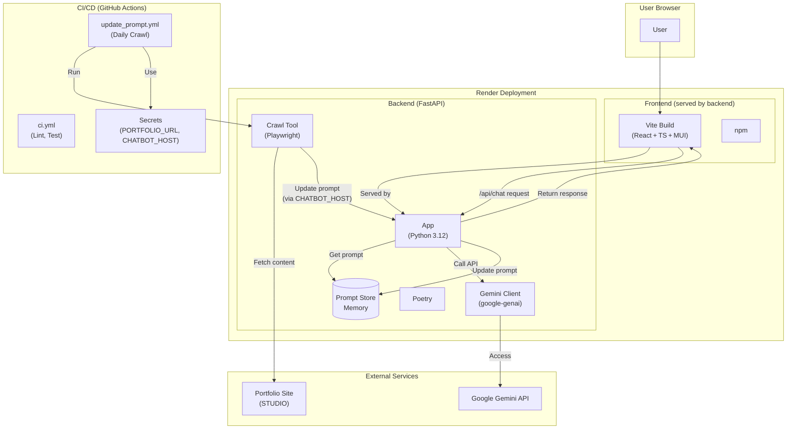

# Portfolio‑ChatBot

**Solo side‑project** — A chatbot that lives inside my online portfolio  
(<https://hayatasakataportfolio.studio.site/>) and keeps itself **always up‑to‑date** by crawling the page daily.

[](#license)  

<p align="center">
  <a href="https://hayatasakataportfolio.studio.site/" target="_blank"><strong>▶︎ Try it now!</strong></a>
</p>


## ✨ Why / Impact
Recruiters often skim dozens of portfolios. This bot answers their questions in natural language, cutting their reading time while showcasing my projects interactively.

## 🔑 Key Features
| Category            | Description                                                                     |
|---------------------|---------------------------------------------------------------------------------|
| **Iframe Ready**    | Drop‑in embed for any STUDIO site.                                              |
| **Auto‑Crawl**      | Playwright fetch → diff → prompt regenerate (daily via GitHub Actions).          |
| **Instant Deploy**  | Single Render service hosts **FastAPI backend + built React frontend**.         |
| **Zero‑Ops**        | No database; prompt lives in memory and reloads in‑place.                       |

## 🛠 Tech Stack
- **Frontend** Vite · React · TypeScript · MUI
- **Backend** Python 3.12 · FastAPI · Pydantic · Playwright · google‑genai
- **Tooling** Poetry · npm · Ruff · Mypy
- **CI/CD** GitHub Actions
- **Hosting** Render

## 📂 Repository Layout
```text
portfolio_chatbot/
├── .github/
│   └── workflows/               # GitHub Actions workflows
│       ├── ci.yml               # Backend lint/test CI
│       └── update_prompt.yml    # Prompt auto-update (daily crawl)
├── backend/
│   ├── app/                     # Core FastAPI application
│   │   ├── api/                 # API endpoint definitions
│   │   │   ├── chat.py          # Chat API (/api/chat)
│   │   │   └── prompt.py        # Prompt update/retrieve API (/api/prompt/*)
│   │   ├── models.py            # Pydantic data models
│   │   ├── prompt_store.py      # Prompt storage (in-memory)
│   │   ├── session_manager.py   # Chat session management (in-memory)
│   │   └── main.py              # FastAPI entry point and static file serving
│   ├── tools/                   # Utility tools
│   │   └── crawl_and_patch.py   # Portfolio site crawling & prompt-update script
│   ├── prompt_config.py         # Prompt template configuration
│   ├── pyproject.toml           # Poetry dependency definitions
│   └── poetry.lock              # Dependency lock file
├── frontend/
│   ├── src/                     # React application source
│   │   ├── components/          # React components
│   │   │   └── ChatWidget.tsx   # Chat UI component
│   │   ├── App.tsx              # Main application component
│   │   ├── theme.ts             # MUI theme customization (chat colors, etc.)
│   │   └── main.tsx             # React app entry point
│   ├── index.html               # HTML entry point
│   ├── package.json             # npm dependency definitions
│   └── vite.config.ts           # Vite configuration file
├── .gitignore                   # Git ignore file
└── README.md                    # This file
````

## 🏗 Architecture



## 🚀 Local Setup

1.  **Clone the repository:**
    ```   
    git clone <repository-url>
    cd portfolio_chatbot
    ```
2.  **Build Frontend:**
    *   Navigate to the frontend directory: cd frontend
    *   Install dependencies: npm install
    *   Build static files: npm run build (Output will be in frontend/dist)
    *   Navigate back to root: cd ..
3.  **Backend Setup & Run:**
    *   Navigate to the backend directory: cd backend
    *   Create a .env file and set GOOGLE_API_KEY and optionally PORTFOLIO_URL, CHATBOT_HOST (for local testing of the crawl script).
    *   Install dependencies: poetry install
    *   Run the backend server: poetry run uvicorn app.main:app --reload --port 8000
    *   Access the application at http://localhost:8000 (Backend serves frontend)

## 🤖 System Prompt Lifecycle

1. **Daily Action** runs `crawl_and_patch.py`.
2. New HTML → new prompt → `/api/prompt/update` → in‑memory store hot‑swaps.
3. Manual re‑run possible from the Actions tab.

## 📜 License

MIT License
